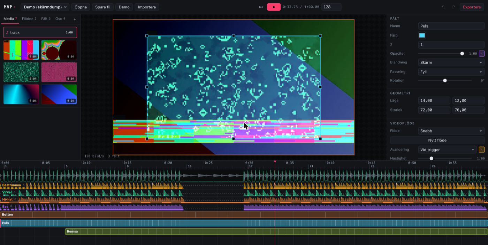
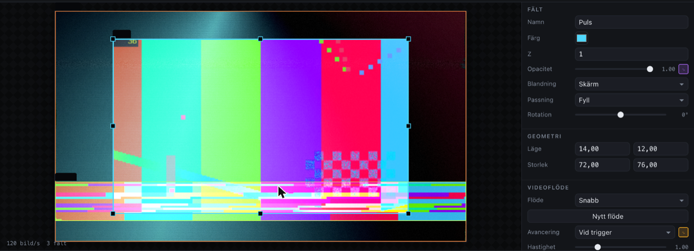
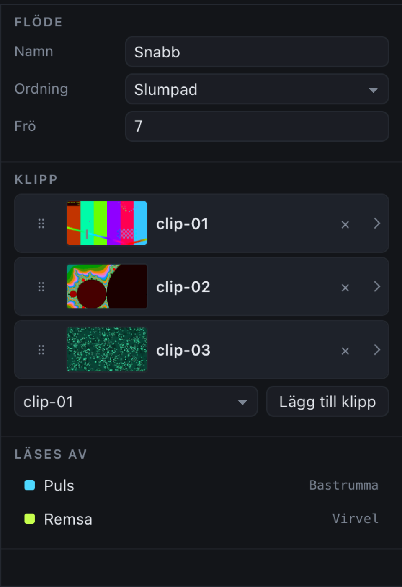
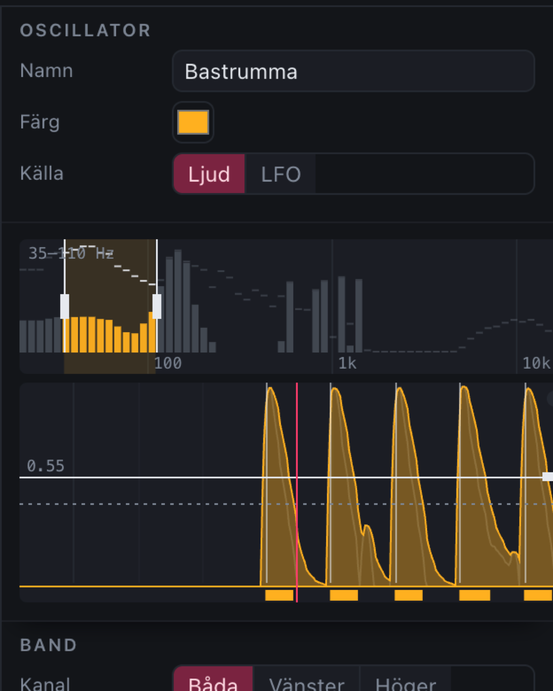
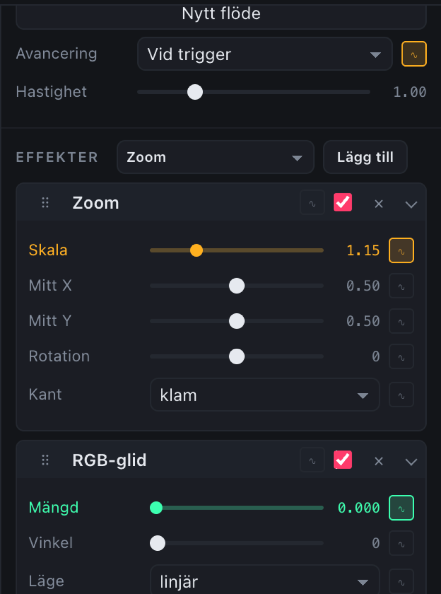
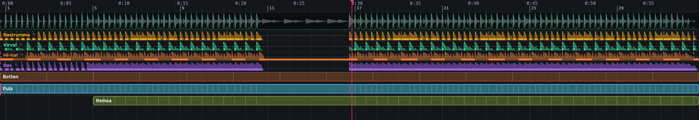
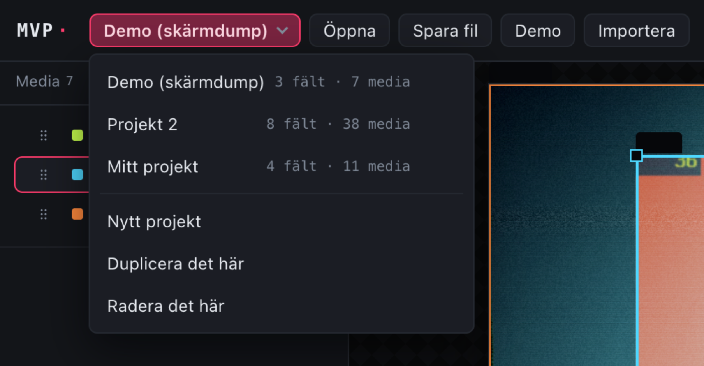
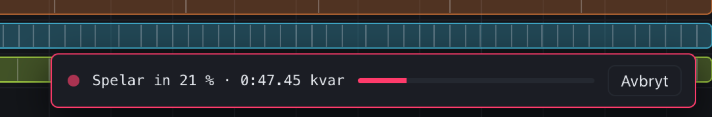

# Musikvideoproducenten

[](https://www.patreon.com/AndersBjarby)

En ljudreaktiv videosynt med tidslinje. Du lägger ut **fält** på videoytan, kopplar
**videoflöden** till dem, och låter **oscillatorer** — av/på-brytare knutna till
frekvensband i låten — styra vad som syns, när klippen byts och hur effekterna slår.

```
frekvensband  →  triggernivå  →  oscillator  →  koppling  →  något händer i bilden
```



Vanilla ES-moduler, inget byggsteg, inga beroenden. WebGL2 för kompositionen.

## Kom igång

```bash
npm run assets     # genererar testlåt och sex videoloopar (kräver ffmpeg + python3)
npm start          # http://localhost:8162
```

Klicka **Demo** i verktygsraden för ett färdigt uppsatt projekt, eller släpp egna
video- och ljudfiler på fönstret.

## Så hänger det ihop

Fyra ytor, och en riktning genom dem: biblioteket till vänster håller projektets
delar, scenen i mitten visar resultatet, inspektorn till höger redigerar det
markerade, och tidslinjen längst ned är där musiken möter bilden.

Alla tre gränserna går att dra i, och dubbelklick på en avdelare återställer den.

### Fält

En rektangel på videoytan med plats, storlek, z-ordning, blandningsläge och ett
eller flera **tidsspann** då det existerar. Dras direkt på scenen — kanterna
snappar mot scenens mitt och mot andra fält. Spannen dras i tidslinjen.



### Videoflöde

En hög med klipp och en ordning att beta av dem i: sekventiellt, slumpmässigt
eller fram-och-tillbaka. Slumpen är seedad, så samma projekt ger alltid samma
klippordning.

**Högen säger *vilka* klipp. Fältet säger *när* man byter.** Avancering,
hastighet och vilken oscillator som triggar bytet sitter på fältet — därför kan
två fält dela samma klipphög och ändå klippa i helt olika takt: ett som hackar på
bastrumman, ett som byter på virveln. Ger man dem samma inställningar går de i lås
igen, för schemat är en ren funktion av (hög, inställningar, flanker).



Klippen visas med miniatyrbild — **för musen över bilden för att bläddra genom
klippet**. Dra media från biblioteket till klipplistan för att lägga till;
insättningslinjen visar var det hamnar. Ett flöde kan också dras från
Flöden-fliken och släppas direkt på ett fält på scenen.

### Oscillator

Lyssnar på ett frekvensband (till exempel 35–110 Hz för bastrumman), jämför mot en
triggernivå och fungerar som en brytare.

| Läge | Beteende |
| --- | --- |
| `Grind` | hög så länge signalen ligger över tröskeln |
| `Puls` | hög en bestämd tid efter varje anslag |
| `Växla` | flippar tillstånd vid varje anslag |

`Dela` gör att den bara reagerar på var N:te anslag. Den kan lyssna på vänster
kanal, höger kanal eller båda — panorerade element går alltså att skilja åt även
när de ligger i samma frekvensband. Och den kan vara en fri LFO i stället, i hertz
eller i beats.



Överst i oscillatorns panel sitter ett **skop** som är fastnålat, så det syns även
när du rullat ned till attack och release:

- **Spektrumet** visar ljudet just nu med topphållning. Det valda bandet är
  markerat — dra i kanterna för att ändra gränserna, dra i mitten för att flytta
  hela bandet.
- **Tidsfönstret** visar envelopen, triggernivån som en dragbar linje, hysteresen
  streckad, öppna grindar som ett band längst ned och varje flank som ett streck.
  Spelhuvudet står i mitten och musiken rullar förbi. Scrolla för att zooma mellan
  0,4 och 40 sekunder.

Oscillatorn kompileras om under själva draget, så triggarna framför och bakom
spelhuvudet flyttar sig medan du håller i musen. Det är så man hittar rätt nivå.

### Effekter

Sexton stycken: zoom, skak, spegel, skivor, glitch, VHS, RGB-glid, strobe, pixla,
posterisera, kanter, invert, färg, oskärpa, blom och efterbild. De läggs på ett
fält och appliceras på fältets videoflöde.



**Varje enskild parameter** har en `∿`-knapp och kan kopplas till sin egen
oscillator — zoomens skala mot bastrummans envelope, glitchens mängd mot virvelns
puls, rotationen mot en LFO, allt i samma effekt samtidigt. `∿` i effektens rubrik
grindar hela effekten.

En kopplad parameter styrs inte längre av sitt reglage, så reglaget blir i stället
en **mätare**: tummen följer musiken i oscillatorns färg och siffran visar det
verkliga värdet just nu. Lysdioden i effektens rubrik tänds när grinden är öppen.

### Tidslinjen



Uppifrån och ned: linjal med takter, vågform med onset-kurva, ett spår per
oscillator (envelope, triggernivå, öppna grindar, flanker) och ett spår per fält
(tidsspann med klippbytena inritade).

Oscillatorspåren tar plats. Klicka **krysset i spårets namnplatta** för att dölja
ett spår; ögat i Osc-fliken tänder det igen. Ett dolt spår tar ingen höjd alls, och
oscillatorn fortsätter styra bilden precis som förut.

**Högerklick på ett fältspann delar fältet** där du klickar — delen efter snittet
blir ett nytt fristående fält med samma egenskaper.

## Projekt

Du arbetar alltid i ett projekt. Varje projekt har sina egna inställningar, sin
egen tidslinje, sina egna oscillatorer **och sina egna mediafiler**.



Att mediafilerna ägs av projektet betyder att samma klipp importerat i två projekt
lagras två gånger. Det är avsiktligt: alternativet vore en delad hög där varje
radering blir en fråga om vem mer som råkar använda filen. Nu är radering
fullständig — projektet och dess filer försvinner tillsammans.

Allt du gör **autosparas** var fjärde sekund och vid varje flikbyte. `Spara fil`
skriver dessutom ut projektet som `.mvp.json`; mediafilerna följer inte med i
filen, men släpper du projektfilen tillsammans med mediafilerna på mottagarens
dator syr importen ihop dem igen. `Öppna` läser alltid in en projektfil som ett
**nytt** projekt med egna kopior av de mediafiler som finns lokalt.

## Export



Exporten spelar in i realtid — en fyra minuter lång låt tar fyra minuter. Under
tiden ligger en inspelningsrad nere till höger med förlopp, återstående tid och en
avbrytknapp; scenen lämnas fri så att du ser vad du spelar in, och tangentbordet
är spärrat så att ett mellanslag i gammal vana inte förstör tagningen.

## Varför analysen körs i förväg

Hela låten avkodas och körs genom en STFT vid import. Bandenergin sparas för varje
bildruta (64 logaritmiskt spridda band, ~86 bildrutor i sekunden), och varje
oscillator *kompileras* till en färdig lista av envelope, flanker och
gate-intervall.

Det gör en oscillator till en **ren funktion av tiden**. Tre saker följer:

1. Du kan scrubba fritt och alltid se rätt bild.
2. Tidslinjen kan rita ut exakt var varje trigger hamnar innan du spelar upp.
3. Exporten blir identisk med förhandsvisningen.

En live-`AnalyserNode` hade inte kunnat något av det — med den finns bandenergin
bara medan låten spelar.

Samma princip gäller klippen: varje fälts klippschema räknas fram för hela låten
som en segmentlista, och slumpen är seedad. Därför kan videopoolen förbereda nästa
klipp *innan* snittet, så att bytet blir sömlöst.

## Tangenter

| | |
| --- | --- |
| `mellanslag` | spela/pausa |
| `J` / `L` | −5 s / +5 s |
| `,` / `.` | föregående / nästa beat |
| `Home` / `End` | början / slut |
| piltangenter | nudda markerat fält (`⇧` = 10 px) |
| `⌘D` | duplicera markerat fält/flöde/oscillator |
| `S` / `⌘K` | dela markerat fält vid spelhuvudet |
| `⌫` | ta bort markerat objekt |
| `⌥`+klick på ett spann | ta bort spannet |
| `⌘Z` / `⇧⌘Z` | ångra / gör om |
| `⌘S` / `⌘E` | spara projektfil / exportera video |

I tidslinjen: **dubbelklick i linjalen zoomar ut till hela låten**, dubbelklick i
tom yta på en fältrad skapar ett spann (en spökkontur visar var innan du klickar),
scroll rullar lodrätt, `⇧`+scroll panorerar i tid, `⌘`+scroll zoomar, och `⇧` under
drag stänger av snappning mot taktrutnätet. På scenen: `⌥` under drag stänger av
snappning mot kanter och andra fält.

## Teknik

Vanilla ES-moduler, inget byggsteg, inga beroenden. WebGL2 för kompositionen —
varje fält renderas i egen FBO, effektkedjan kör ping-pong mellan två FBO:er, och
resultatet komponeras med blandningsläge och opacitet. Media och projekt sparas i
IndexedDB. Export sker via `MediaRecorder`.

`CONTRACT.md` är bindande för modulgränser, datatyper och shader-signaturer — den
beskriver bland annat determinismkravet som hela arkitekturen vilar på.
`npm test` kör enhetstesterna för de rena modulerna.

```
src/
  core/     model, store, frame          — projektdata och bildtillståndet vid tiden t
  audio/    dsp, oscillator, analysis    — STFT, bandbank, kompilerade oscillatorer
  video/    flow, player                 — klippscheman och videoelementpoolen
  gl/       renderer, effects/           — WebGL2-kompositor och sexton effekter
  store/    media, projects, project-io  — IndexedDB, projekt och filer
  ui/       timeline, stage, inspector, library, scope, thumb, projectmenu
```
